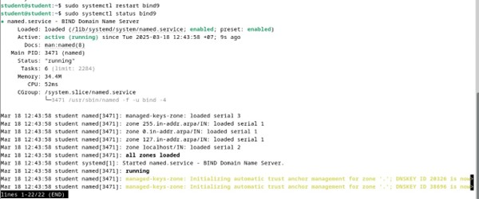
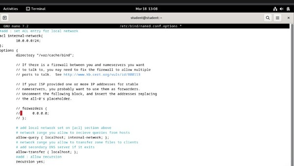
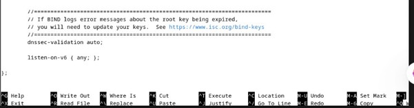
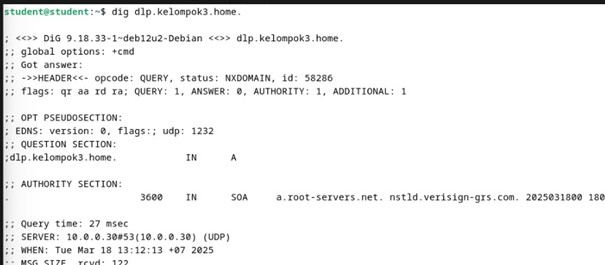

<div align="center">
    <h1 style="text-align: center;font-weight: bold">Laporan Workshop Administrasi Jaringan<br></h1>
    <h2 style="text-align: center;">Instalasi Debian <br></h2>
    <h4 style="text-align: center;">Dosen Pengampu : Dr. Ferry Astika Saputra, S.T., M.Sc.</h4>
</div>
<br />
<div align="center">
    
    <h3 style="text-align: center;">Disusun Oleh :</h3>
    <p style="text-align: center;">
        <strong>Marieta Nona Alfani (3123500025)</strong>
    </p>
    <h3 style="text-align: center;line-height: 1.5">Politeknik Elektronika Negeri Surabaya<br>Departemen Teknik Informatika Dan Komputer<br>Program Studi Teknik Informatika<br>2025/2026</h3>
    <hr>
</div>
<br>

# DNS SERVER

## 1. Pengertian DNS Server

DNS (Domain Name System) adalah sistem yang mengonversi nama domain yang mudah dibaca manusia menjadi alamat IP yang digunakan oleh komputer untuk berkomunikasi di jaringan. Struktur DNS bersifat hierarkis dan terdiri dari beberapa tingkatan.

## 2. Struktur Hierarki DNS

- **Root Level**: Tingkat paling atas dalam hierarki DNS, dilambangkan dengan simbol `.`. Root Server menyimpan informasi tentang Top-Level Domains (TLDs) dan mengarahkan permintaan ke server yang sesuai.
- **Top-Level Domains (TLDs):**
  - Generic TLDs (gTLDs): Contoh `.com`, `.org`, `.net`.
  - Country-code TLDs (ccTLDs): Contoh `.id`, `.jp`, `.au`.
  - Infrastructure TLD: Seperti `.arpa` untuk keperluan infrastruktur jaringan.
  - Internationalized TLDs (IDN): Domain dengan karakter non-Latin.
- **Second-Level Domains (SLDs):** Domain yang berada langsung di bawah TLD, contoh: `apnic.net`.
- **Third-Level Domains:** Subdomain dari SLD, contoh: `training.apnic.net`.
- **Fully Qualified Domain Name (FQDN):** Nama domain lengkap yang mencakup semua tingkatan, contoh: `ws1.training.apnic.net`.

## 3. Cara Kerja DNS

DNS bekerja dengan cara mengubah nama domain menjadi alamat IP melalui proses resolusi DNS. Langkah-langkahnya adalah:
1. Klien mengirim permintaan ke Recursive DNS Server.
2. Recursive DNS Server meneruskan permintaan ke Root Server jika tidak memiliki cache.
3. Root Server mengarahkan permintaan ke TLD Server.
4. TLD Server mengarahkan ke Authoritative DNS Server.
5. Authoritative DNS Server memberikan alamat IP yang sesuai.
6. Recursive DNS Server mengirimkan hasil ke klien.

## 4. Komponen dalam DNS

- **Root Server**: Server yang menyimpan informasi tentang TLDs.
- **TLD Server**: Server yang menyimpan informasi domain berdasarkan kategori.
- **Second-Level Domain Server**: Mengelola domain spesifik dalam suatu TLD.
- **Subdomain Server**: Mengelola subdomain dalam suatu domain utama.

## 5. File Konfigurasi Penting dalam DNS Server
- `/etc/hosts`: Pemetaan manual antara alamat IP dan nama domain.
- `/etc/resolv.conf`: Konfigurasi resolver DNS pada sistem Linux.
- `/etc/nsswitch.conf`: Menentukan urutan pencarian nama host.
- `root.hints`: Daftar Root Name Servers yang digunakan oleh resolver DNS.

## 6. Percobaan DNS

### A. Melihat Konfigurasi DNS

- **Melihat isi `/etc/resolv.conf`**:
  ```bash
  sudo less /etc/resolv.conf
  ```
  
  Menampilkan server DNS yang digunakan oleh sistem.

- **Melihat root hints**:
  ```bash
  less /usr/share/dns/root.hints
  ```
  
  Menampilkan daftar Root Name Servers.

### B. Menguji Resolusi DNS

- **Menggunakan perintah nslookup**:
  ```bash
  nslookup mail.pens.ac.id
  ```
  
  Menampilkan alamat IP dari `mail.pens.ac.id`.

- **Menggunakan perintah ping untuk menguji DNS**:
  ```bash
  ping www.pens.ac.id
  ```
  
  Menguji apakah nama domain dapat di-resolve menjadi alamat IP.

- **Menggunakan traceroute untuk melihat jalur koneksi**:
  ```bash
  traceroute www.google.com
  ```
  
  Menampilkan jalur yang dilalui paket hingga mencapai tujuan.

## 7. Kesimpulan
DNS Server memainkan peran penting dalam menerjemahkan nama domain menjadi alamat IP, sehingga memungkinkan komunikasi yang lebih mudah dalam jaringan. Melalui berbagai percobaan, kita dapat memahami cara kerja DNS, memeriksa konfigurasi, serta menganalisis konektivitas dalam jaringan.

# Konfigurasi BIND untuk Internal Network dan Zone Files

## A. Konfigurasi untuk Internal Network

### 1. Instal BIND


### 2. Tambahkan Konfigurasi Internal
  
  
**Edit konfigurasi opsi:**  
  
  

### 3. Tambahkan Zona Internal
  
  

### 4. Konfigurasi Penggunaan IPv4
  
  

## B. Konfigurasi Zone Files

### 1. Buat Zone Files untuk Resolusi Forward (Domain ke IP)
  
  

### 2. Buat Zone Files untuk Resolusi Reverse (IP ke Domain)
  
  

## C. Verifikasi Resolusi BIND

### 1. Restart BIND untuk Menerapkan Perubahan
  

### 2. Ubah Pengaturan DNS ke Server Sendiri
  
  

### 3. Verifikasi Resolusi Nama dan Alamat
Gunakan perintah `dig` untuk menguji apakah domain dapat di-resolve ke alamat IP:

#### (a) Verifikasi Resolusi Nama ke IP


**Error:** "communications error to 10.0.0.30#53 timed out" menunjukkan bahwa sistem tidak bisa berkomunikasi dengan server DNS pada 10.0.0.30.

### Langkah-Langkah Troubleshooting

1. **Pastikan BIND9 berjalan di server**  
   

2. **Pastikan Port 53 tidak diblokir**  
   

3. **Cek konektivitas jaringan**  
   **Coba ping server DNS:**  
   

4. **Pastikan konfigurasi BIND9 benar**  
   **Edit file named.conf.options:**  
     
     

**Ulang Verifikasi Resolusi Nama ke IP:**  


Dari hasil `dig dlp.kelompok3.home`, terlihat bahwa status yang dikembalikan adalah **NXDOMAIN**, yang berarti nama domain tersebut tidak ditemukan dalam server DNS yang digunakan.

### Penyebab Kemungkinan & Solusi:

1. **Zona Tidak Terdefinisi di Bind9**  
   Pastikan sudah menambahkan zona untuk `kelompok3.home` di file konfigurasi Bind9 (`named.conf.local` atau `named.conf.default-zones`).  
     
   

2. **File Zona Tidak Ada atau Salah Format**  
   Pastikan file zona `/etc/bind/db.kelompok3.home` ada dan berisi konfigurasi yang benar.  
   

3. **Restart Bind9 Setelah Perubahan**  
   

4. **Uji Query Kembali**  
   **(a) Verifikasi Resolusi Nama ke IP**  
   

   **Penjelasan hasil output:**
   - **Status NOERROR** → Domain `dlp.kelompok3.home` berhasil ditemukan oleh server DNS.
   - **ANSWER SECTION** → `dlp.kelompok3.home` memiliki alamat IP `36.86.63.182`, artinya server DNS telah menyelesaikan pencarian domain dengan benar.
   - **AUTHORITY SECTION** → Ada informasi SOA (Start of Authority), menandakan bahwa server DNS bertanggung jawab atas domain ini.
   - **Server DNS yang Digunakan** → Query dilakukan ke `10.0.2.3`, yang merupakan server DNS lokal.

   **(b) Verifikasi Resolusi IP ke Nama**  
   

   **Penjelasan hasil output:**
   1. **Header:**
      - `dig` dijalankan menggunakan versi **DiG 9.18.33-1** pada sistem Debian.
      - **Status NOERROR**, artinya permintaan berhasil diproses tanpa kesalahan.
      - ID kueri: 33936 (ID unik untuk permintaan ini).
   2. **QUESTION SECTION:**
      - `30.0.0.10.in-addr.arpa. IN PTR`
      - Ini menunjukkan bahwa permintaan adalah reverse lookup untuk IP `10.0.0.30`.
   3. **ANSWER SECTION:**
      - `30.0.0.10.in-addr.arpa. 300 IN A 36.86.63.182`
        - Ini berarti alamat IP privat `10.0.0.30` dipetakan ke alamat IP publik `36.86.63.182`.
        - Ini biasanya menunjukkan bahwa `10.0.0.30` diterjemahkan melalui NAT ke IP publik.
   4. **AUTHORITY SECTION:**
      - `prisoner.iana.org` adalah server yang menangani domain `.arpa`, yang digunakan untuk DNS reverse lookup.

---

## Kesimpulan
Dengan mengikuti langkah-langkah di atas, konfigurasi BIND dapat digunakan untuk resolusi nama domain ke IP dan sebaliknya dengan troubleshooting yang sesuai.
