

    <h1 style="text-align: center;font-weight: bold">Tugas Review Deskripsi Workshop Administrasi Jaringan</h1>
    <h4 style="text-align: center;">Dosen Pengampu : Dr. Ferry Astika Saputra, S.T., M.Sc.</h4>

 

   
    <h3 style="text-align: center;">Disusun Oleh : </h3>
    

        <strong>Marieta Nona Alfani</strong> 
        <strong>3123500026 / 2 D3 IT A</strong> 
    

<h3>Politeknik Elektronika Negeri Surabaya Departemen Teknik
Informatika Dan Komputer Program Studi Teknik Informatika 2024/2025</h3>
    

    

# Konfigurasi BIND untuk Internal Network dan Zone Files

## A. Configure for Internal Network

### 1. Instal BIND
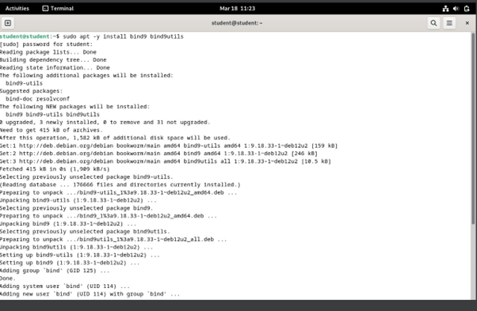

### 2. Tambahkan Konfigurasi Internal

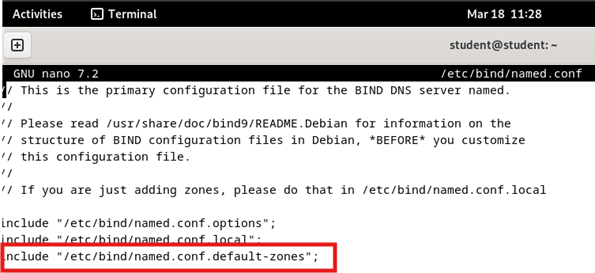
**Edit konfigurasi opsi:**

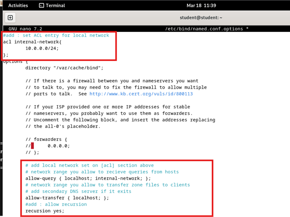

### 3. Tambahkan Zona Internal

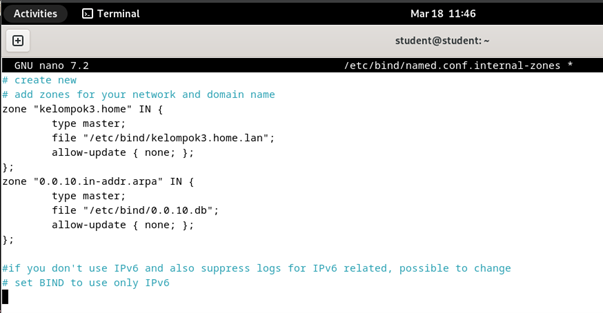

### 4. Konfigurasi Penggunaan IPv4

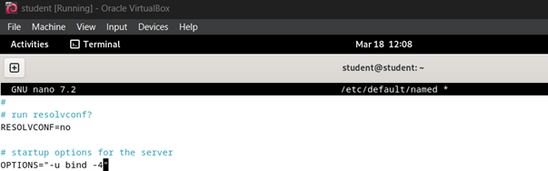

## B. Configure Zone Files

### 1. Buat Zone Files untuk Resolusi Forward (Domain ke IP)
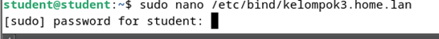
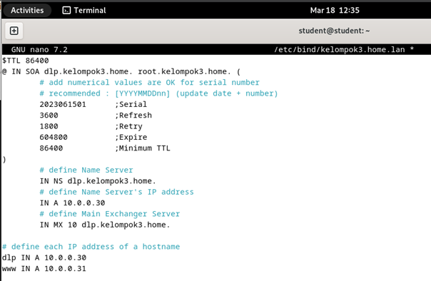

### 2. Buat Zone Files untuk Resolusi Reverse (IP ke Domain)
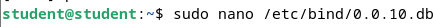
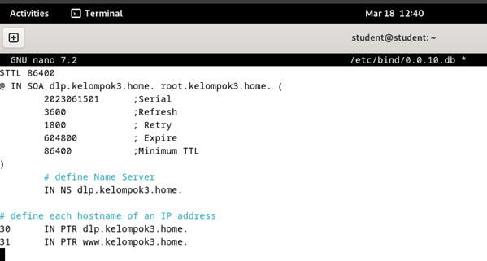

## C. BIND Verify Resolution

### 1. Restart BIND untuk Menerapkan Perubahan

### 2. Ubah Pengaturan DNS ke Server Sendiri

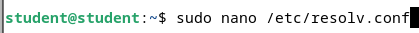

### 3. Verifikasi Resolusi Nama dan Alamat
Gunakan perintah `dig` untuk menguji apakah domain dapat di-resolve ke alamat IP:

#### (a) Verifikasi Resolusi Nama ke IP
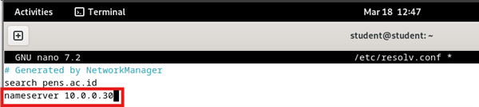

**Error:** "communications error to 10.0.0.30#53 timed out" menunjukkan bahwa sistem tidak bisa berkomunikasi dengan server DNS pada 10.0.0.30.

### Langkah-Langkah Troubleshooting
1. **Pastikan BIND9 berjalan di server**  
   

2. **Pastikan Port 53 tidak diblokir**  
   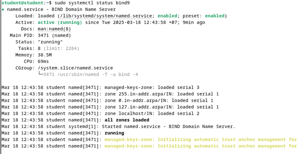

3. **Cek konektivitas jaringan**  
   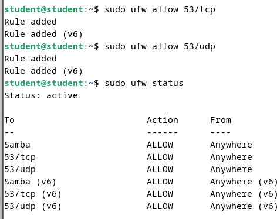
   
   **Coba ping server DNS:**  
   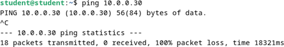

4. **Pastikan konfigurasi BIND9 benar**  
   **Edit file named.conf.options:**  
   
   

**Ulang Verifikasi Resolusi Nama ke IP:**  

Dari hasil `dig dlp.kelompok3.home`, terlihat bahwa status yang dikembalikan adalah **NXDOMAIN**, yang berarti nama domain tersebut tidak ditemukan dalam server DNS yang digunakan.

### Penyebab Kemungkinan & Solusi:
1. **Zona Tidak Terdefinisi di Bind9**
   Pastikan sudah menambahkan zona untuk `kelompok3.home` di file konfigurasi Bind9 (`named.conf.local` atau `named.conf.default-zones`).
   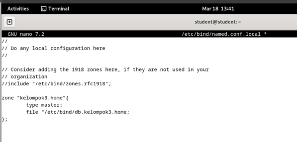
   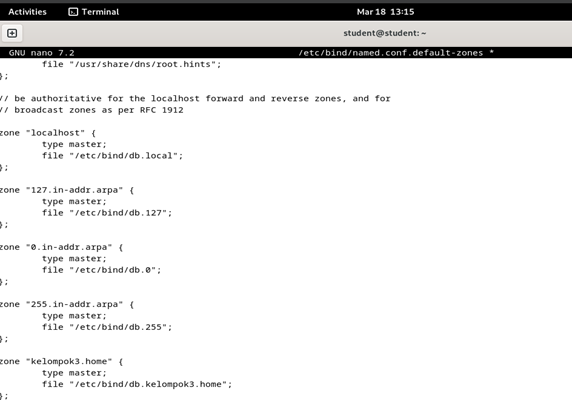

2. **File Zona Tidak Ada atau Salah Format**
   Pastikan file zona `/etc/bind/db.kelompok3.home` ada dan berisi konfigurasi yang benar.
   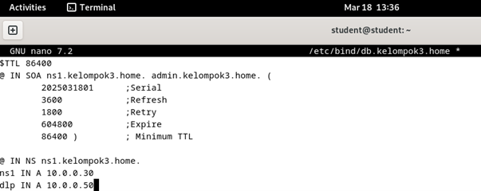

3. **Restart Bind9 Setelah Perubahan**
   

4. **Uji Query Kembali**
   **(a) Verifikasi Resolusi Nama ke IP**  
   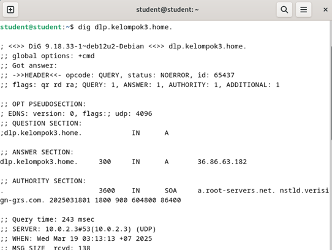

   **Penjelasan hasil output:**
   - **Status NOERROR** → Domain `dlp.kelompok3.home` berhasil ditemukan oleh server DNS.
   - **ANSWER SECTION** → `dlp.kelompok3.home` memiliki alamat IP `36.86.63.182`, artinya server DNS telah menyelesaikan pencarian domain dengan benar.
   - **AUTHORITY SECTION** → Ada informasi SOA (Start of Authority), menandakan bahwa server DNS bertanggung jawab atas domain ini.
   - **Server DNS yang Digunakan** → Query dilakukan ke `10.0.2.3`, yang merupakan server DNS lokal.

   **(b) Verifikasi Resolusi IP ke Nama**
   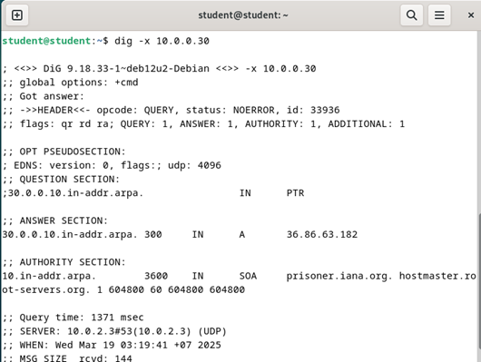

   **Penjelasan hasil output:**
   1. **Header:**
      - `dig` dijalankan menggunakan versi **DiG 9.18.33-1** pada sistem Debian.
      - **Status NOERROR**, artinya permintaan berhasil diproses tanpa kesalahan.
      - ID kueri: 33936 (ID unik untuk permintaan ini).
   2. **QUESTION SECTION:**
      - `30.0.0.10.in-addr.arpa. IN PTR`
      - Ini menunjukkan bahwa permintaan adalah reverse lookup untuk IP `10.0.0.30`.
   3. **ANSWER SECTION:**
      - `30.0.0.10.in-addr.arpa. 300 IN A 36.86.63.182`
        - Ini berarti alamat IP privat `10.0.0.30` dipetakan ke alamat IP publik `36.86.63.182`.
        - Ini biasanya menunjukkan bahwa `10.0.0.30` diterjemahkan melalui NAT ke IP publik.
   4. **AUTHORITY SECTION:**
      - `prisoner.iana.org` adalah server yang menangani domain `.arpa`, yang digunakan untuk DNS reverse lookup.

---

**Kesimpulan:** Dengan mengikuti langkah-langkah di atas, konfigurasi BIND dapat digunakan untuk resolusi nama domain ke IP dan sebaliknya dengan troubleshooting yang sesuai.
