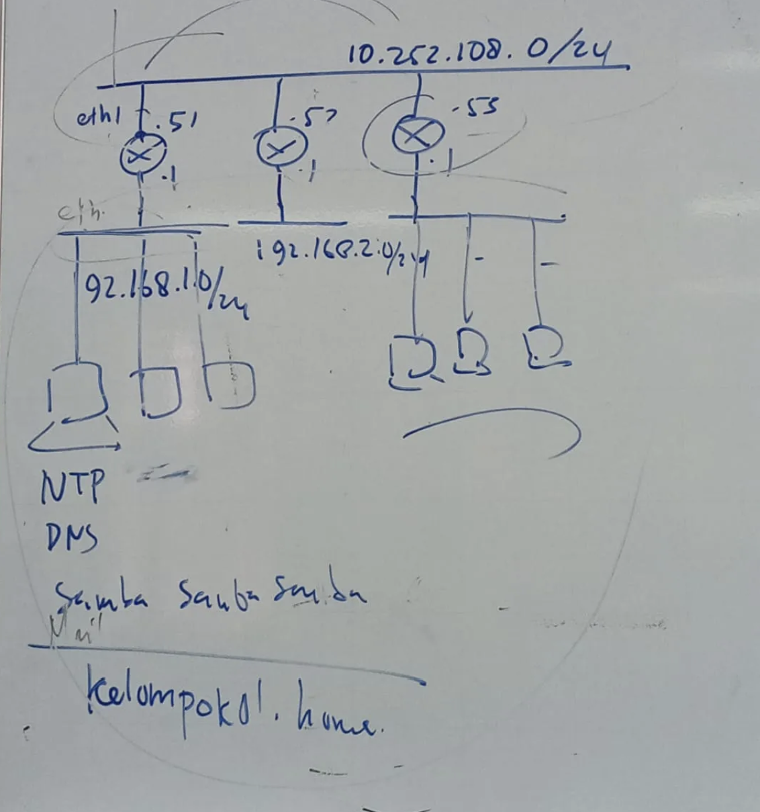
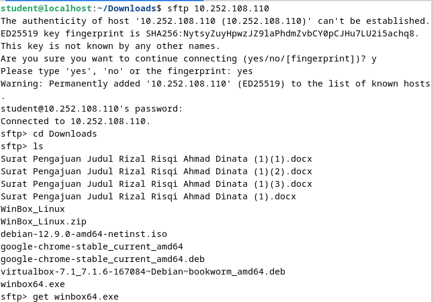
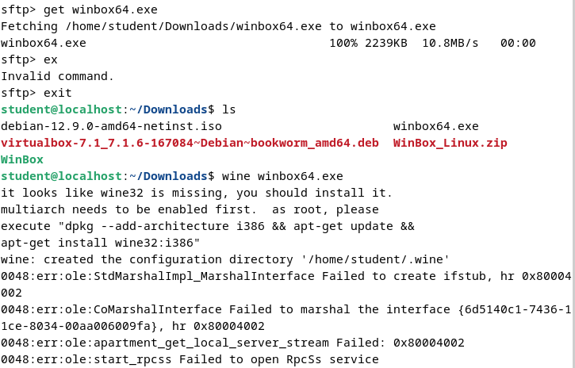
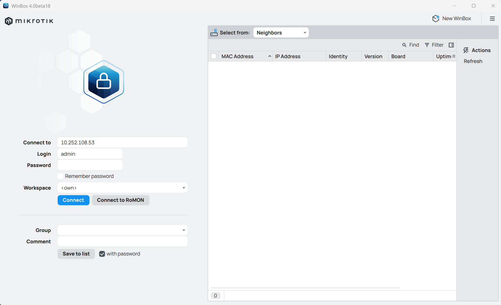
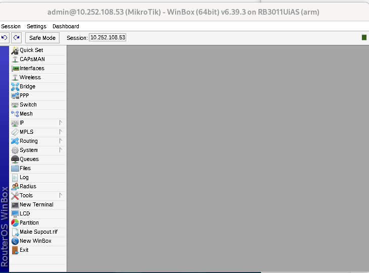
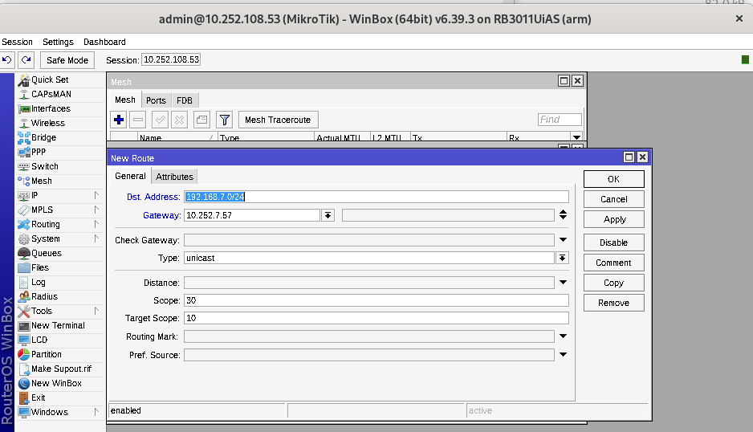

  <h1 style="text-align: center;font-weight: bold">Laporan Workshop Administrasi Jaringan</h1>
  <h4 style="text-align: center;">Dosen Pengampu : Dr. Ferry Astika Saputra, S.T., M.Sc.</h4>

 

  
  <h3 style="text-align: center;">Disusun Oleh :</h3>
  

    <strong>Marieta Nona Alfani</strong> 
    <strong>3123500026</strong>
  

<h3 style="text-align: center;line-height: 1.5">Politeknik Elektronika Negeri Surabaya Departemen Teknik Informatika Dan Komputer Program Studi Teknik Informatika 2024/2025</h3>
  

## Daftar Isi

1. [Tugas](#tugas)
2. [Hasil Percobaan](#hasil-percobaan)

## Tugas 

1. Melakukan Instalisasi Winbox 
2. Konfigurasi Layer Network
   Percobaan awal yang dilakukan berdasarkan skema di atas adalah menghubungkan perangkat MikroTik antar kelompok. Tujuan dari langkah ini adalah agar setiap laptop yang tergabung dalam jaringan LAN dapat saling berkomunikasi, khususnya melakukan uji koneksi (ping) ke IP kelompok lainnya. 
   
   Untuk melakukan hal tersebut, salah satu laptop dari setiap kelompok perlu dihubungkan ke jaringan LAN dan menjalankan perintah ping guna menguji konektivitas. Pada percobaan ini, digunakan rentang alamat IP 10.252.108.5x, di mana x mewakili nomor kelompok masing-masing. Karena saya kelompok 3, maka IP MikroTik yang digunakan adalah 10.252.108.53. 
   
   Setelah perangkat berhasil terhubung ke jaringan melalui kabel LAN, pengujian koneksi dapat dilakukan melalui Command Prompt di sistem operasi Windows dengan menggunakan perintah ping terhadap IP tujuan.
3. Ping device kelompok lain sesuai networknya

## Hasil Percobaan

1. Install Wine
   
   

   Instalasi ini dibutuhkan agar aplikasi Winbox, yang hanya tersedia untuk Windows, bisa dijalankan di Linux. Untuk itu, digunakan Wine, sebuah tool yang memungkinkan aplikasi Windows berjalan di sistem operasi Linux tanpa perlu emulator penuh atau virtual machine.

2. Install Winbox melalui SFTP – Kelompok 5

   

   

3. Mencoba ping network 10.252.108.53

   

   Berdasarkan hasil pengujian, jaringan milik Kelompok 3 berhasil terdeteksi saat perangkat terhubung ke jaringan LAN. Alamat IP yang teridentifikasi adalah 10.252.108.53.

4. Hubungkan Winbox ke Mikrotik menggunakan IP address 10.252.108.53.
    
   

   

5. Lakukan pengujian koneksi (ping) ke jaringan 192.168.1.0/24, yang dimiliki oleh Kelompok 1.

   

   Untuk melakukan routing, buka menu IP > Routes pada Winbox. Tambahkan entri baru dengan destination network: 192.168.1.0/24, lalu isi kolom gateway dengan IP address 10.252.108.51 (dalam contoh ini, gateway merujuk pada IP milik Kelompok 7).

Setelah konfigurasi selesai, klik tombol OK untuk menyimpan perubahan.

Agar tidak membingungkan, sembunyikan IP yang tidak terhubung langsung ke perangkat Mikrotik. Setelah itu, lakukan pengujian koneksi dengan menjalankan perintah ping 10.252.108.51 melalui Command Prompt.

Sebagai referensi, gambar di bawah menunjukkan hasil ping yang berhasil menuju jaringan 192.168.1.0/24.

   

  Jika pengujian ping seperti pada langkah sebelumnya berhasil dilakukan, dan setiap koneksi tidak menunjukkan status Request Timed Out atau pesan kesalahan lainnya, maka dapat disimpulkan bahwa koneksi antar perangkat dari kelompok yang berbeda telah berhasil terjalin dengan baik.
   
