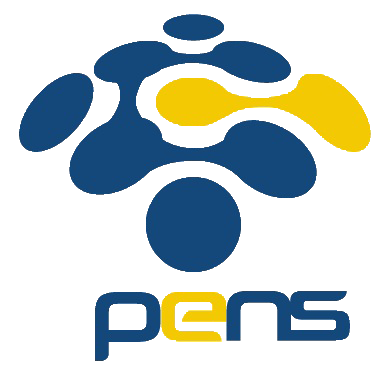
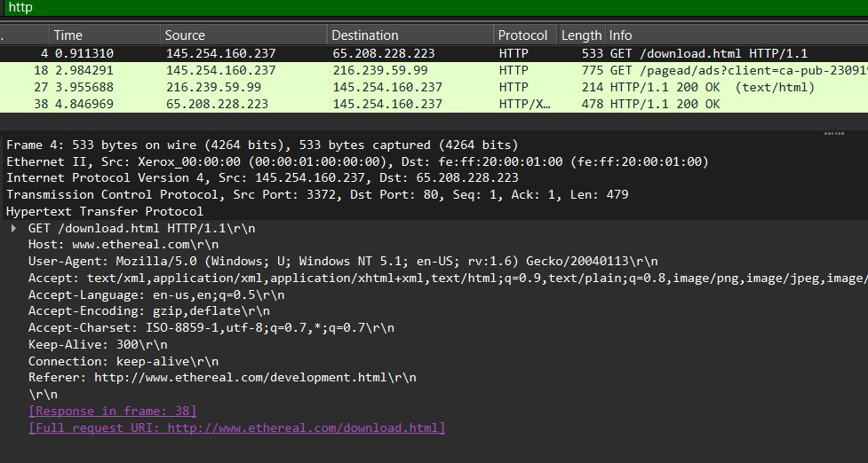
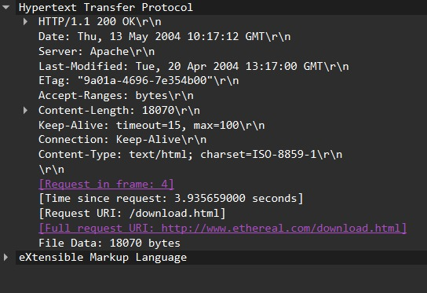
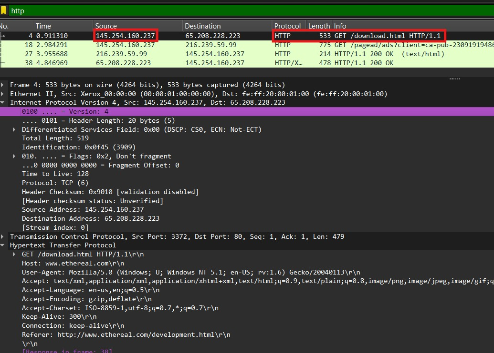
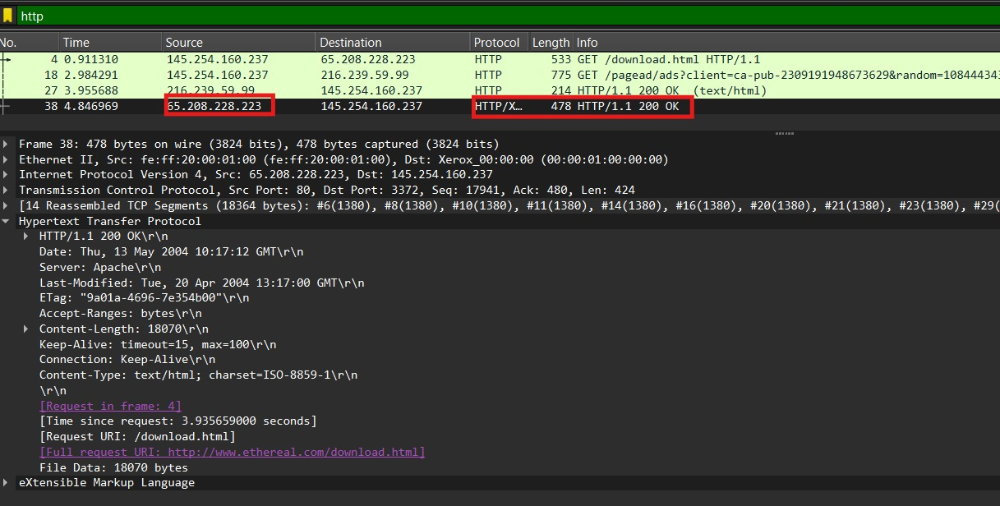
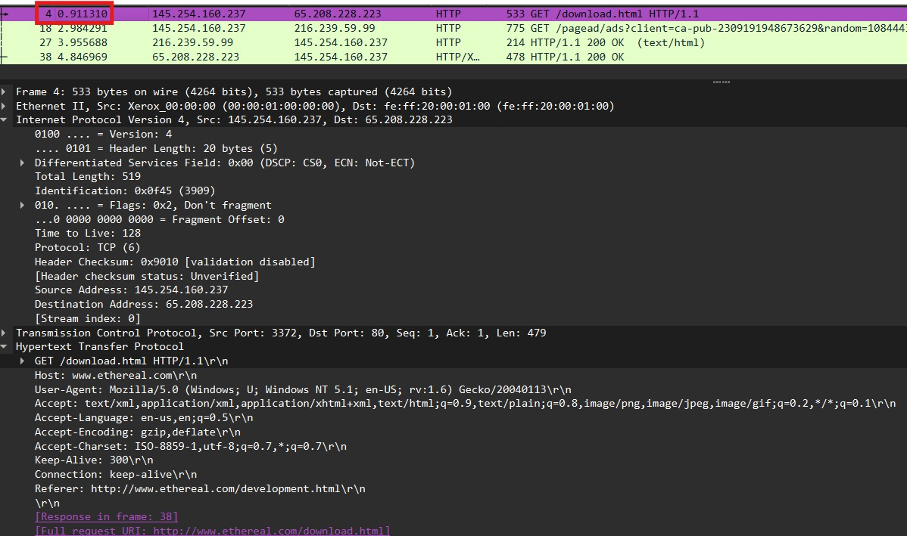
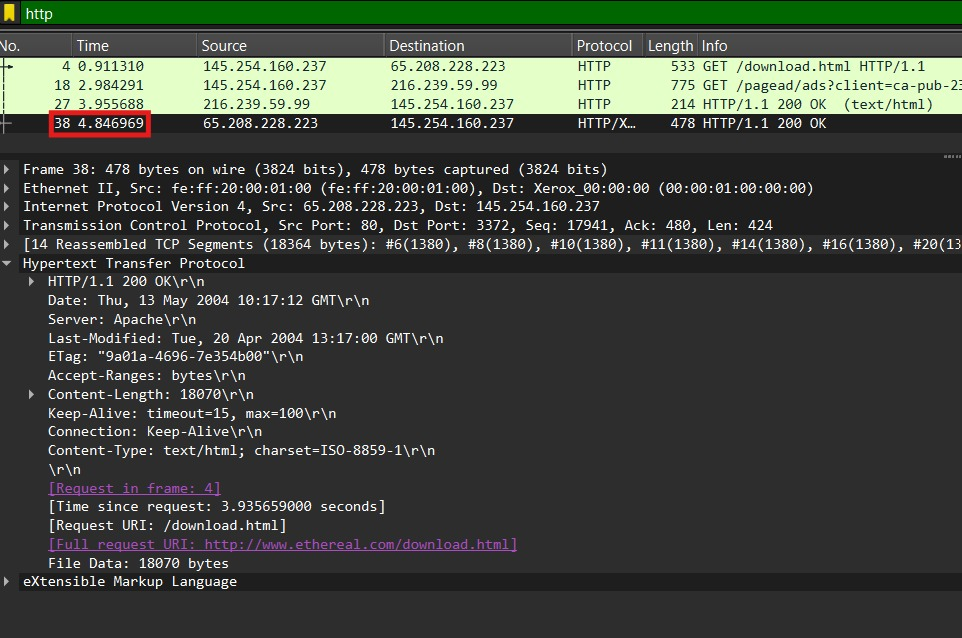
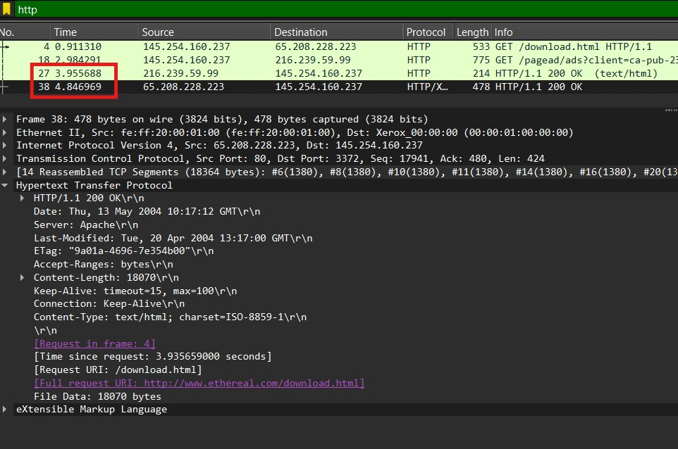
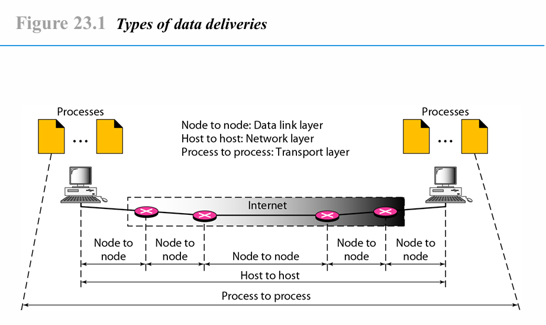

    <h1 style="text-align: center;font-weight: bold">Tugas Review Deskripsi Workshop Administrasi Jaringan</h1>
    <h4 style="text-align: center;">Dosen Pengampu : Dr. Ferry Astika Saputra, S.T., M.Sc.</h4>

 

    
    <h3 style="text-align: center;">Disusun Oleh : </h3>
    

        <strong>Marieta Nona Alfani</strong> 
        <strong>3123500026 / 2 D3 IT A</strong> 
    

<h3>Politeknik Elektronika Negeri Surabaya Departemen Teknik
Informatika Dan Komputer Program Studi Teknik Informatika 2024/2025</h3>
    

    

## Daftar Isi
- [Analisa file HTTP dengan Wireshark](#analisa-file-http-dengan-wireshark)
- [Deskripsi gambar pada slide](#deskripsi-gambar-pada-slide)
- [Rangkuman tahapan komunikasi menggunakan TCP](#rangkuman-tahapan-komunikasi-menggunakan-tcp)
- [Referensi](#referensi)

## Analisa file http dengan wireshark

### Soal 1

**Pertanyaan:**
Berapa versi HTTP yang digunakan?

**Jawaban:**  

 
&nbsp;&nbsp; Versi HTTP yang digunakan adalah HTTP/1.1, seperti yang terlihat dari request dan response dalam hasil Follow TCP Stream.
 
 
 
### Soal 2

**Pertanyaan:**
Berapa IP address dari client maupun server?

**Jawaban:**  
 
  
&nbsp;&nbsp;  Alamat IP yang digunakan oleh HTTP Client adalah 145.254.160.237, sedangkan HTTP Server memiliki alamat IP 65.208.228.223. Koneksi antara keduanya memungkinkan pertukaran data melalui protokol HTTP untuk keperluan pengiriman dan penerimaan informasi.
 
 
 
### Soal 3

**Pertanyaan:**
Berapa waktu dari client mengirimkan HTTP request?

**Jawaban:**  
  
&nbsp;&nbsp;  Permintaan HTTP dari client dikirimkan pada waktu 0,911310 detik. Proses ini menandai awal komunikasi antara client dan server dalam pertukaran data. 
 
 
 
### Soal 4

**Pertanyaan:**
Berapa Waktu dari server mengirimkan server? dan berapa durasinya?

**Jawaban:**  
 
  
&nbsp;&nbsp; Proses pengiriman data dari client ke server dapat diketahui dengan menghitung selisih antara waktu pengiriman HTTP request oleh client dan waktu pengiriman respons oleh server. Berdasarkan data yang diperoleh, server mengirimkan respons pada detik ke 3,955688, sedangkan client mengirimkan request pada detik ke 4,846969.

Selisih waktu tersebut dapat dihitung sebagai berikut:
4,846969 - 3,955688 = 0,891281

   Dengan demikian, diperlukan waktu sekitar 0,891281 detik untuk menyelesaikan satu siklus pengiriman dan penerimaan data dalam bentuk HTTP Response. Durasi ini mencerminkan efisiensi komunikasi antara client dan server, yang dapat bervariasi tergantung pada kondisi jaringan dan performa server. 
 
 
 
## Deskripsi gambar pada slide 
 

&nbsp;&nbsp; Gambar di atas adalah *Types of Data Deliveries* dan menjelaskan bagaimana data dikirim dari satu perangkat ke perangkat lain melalui jaringan. Ada tiga jenis pengiriman data yang ditunjukkan berdasarkan lapisan dalam model OSI:

1. **Node to Node (Data Link Layer)**  
Node-to-node data transmission adalah proses pengiriman data antara dua perangkat (node) yang langsung terhubung dalam jaringan. Node-to-node data transmission dalam Data Link Layer terdiri dari beberapa layanan utama:

    a) Layanan Unacknowledged Connectionless
    Data dikirimkan dari node sumber ke node tujuan tanpa konfirmasi penerimaan. Cocok untuk jaringan yang andal dan tidak memerlukan pengiriman        ulang frame yang hilang.

    b)Layanan Acknowledged Connectionless
    Setiap frame yang dikirimkan harus dikonfirmasi penerimaannya. Jika tidak ada konfirmasi dalam waktu tertentu, frame akan dikirim ulang.            Berguna untuk saluran komunikasi yang tidak terlalu andal, seperti jaringan nirkabel.

    c)Layanan Acknowledged Connection-Oriented
    Membutuhkan proses tiga tahap: pembentukan koneksi, transmisi data, dan pelepasan koneksi. Menjamin setiap frame diterima hanya satu kali dan       dalam urutan yang benar. Cocok untuk jaringan yang membutuhkan transmisi data yang lebih andal​

2. **Host to Host (Network Layer)**  
   Host-to-Host Communication adalah proses komunikasi antara dua perangkat dalam jaringan yang terjadi di Network Layer dan Transport Layer.

    Cara Kerja Host-to-Host Communication:
    -Inisiasi Koneksi:
       TCP (berorientasi koneksi): Menggunakan three-way handshake untuk membentuk koneksi sebelum data dikirim.
        UDP (tanpa koneksi): Data dikirim langsung tanpa proses handshake.

    -Transmisi Data:
        Data dikemas dalam segmen dan dikirim melalui jaringan menggunakan alamat IP dan port.

   -Pengendalian Aliran & Kesalahan:
        Flow Control: Mencegah pengiriman data yang terlalu cepat.
        Error Control: Menggunakan metode seperti checksum untuk mendeteksi dan memperbaiki kesalahan.

    -Terminasi Koneksi:
        TCP: Menggunakan four-way handshake untuk menutup koneksi.
        UDP: Tidak memerlukan terminasi khusus.

3. **Process to Process (Transport Layer)**  
   Process-to-Process Communication di Transport Layer memungkinkan aplikasi di dua host berbeda bertukar data menggunakan port number.
        -Identifikasi Proses: Setiap aplikasi diberi nomor port unik untuk memastikan data sampai ke tujuan yang benar.
        -Multiplexing & Demultiplexing: Memungkinkan banyak aplikasi berbagi koneksi dan menerima data sesuai dengan portnya.
        -Protokol Transport:
            TCP: Andalan, berorientasi koneksi, menjamin urutan dan keandalan data.
            UDP: Cepat, tanpa koneksi, cocok untuk streaming dan game online.
 
 
 

## Rangkuman tahapan komunikasi menggunakan TCP
&nbsp;&nbsp; Transmission Control Protocol (TCP) adalah protokol komunikasi yang memastikan pengiriman data yang andal antara perangkat dalam jaringan. Proses komunikasi menggunakan TCP terdiri dari tiga tahapan utama:

Tahapan Komunikasi Menggunakan TCP
1. Three-Way Handshake (Inisialisasi Koneksi)
-Pengirim mengirimkan SYN ke penerima untuk memulai koneksi.
-Penerima merespons dengan SYN-ACK sebagai tanda persetujuan.
-Pengirim mengonfirmasi dengan ACK, koneksi terbentuk.

2. Data Transmission (Pengiriman Data)
-Data dikirim dalam bentuk segmen dengan sequence number.
-Penerima mengirimkan ACK untuk setiap segmen yang diterima dengan benar.
-Jika ada segmen yang hilang atau rusak, penerima meminta pengiriman ulang.

3. Flow Control & Error Handling (Pengendalian Aliran & Kesalahan)
-Sliding Window Protocol digunakan untuk mengontrol jumlah data yang dikirim tanpa menunggu ACK.
-Jika penerima sibuk, ia dapat mengirim Window Size=0 untuk meminta pengirim berhenti sementara.

4. Four-Way Handshake (Terminasi Koneksi)
-Pengirim mengirim FIN untuk memulai pemutusan koneksi.
-Penerima merespons dengan ACK, lalu mengirim FIN.
-Pengirim membalas dengan ACK, koneksi resmi ditutup.
 
 

## Referensi
- [Pekoktenan - Host-to-Host Layer](https://pekoktenan.wordpress.com/2009/04/02/host-to-host-layer/comment-page-1/)
- [YouTube/PowerCert Animated Videos - TCP/IP and OSI Model Explained](https://www.youtube.com/watch?v=5o8CwafCxnU)
- [YouTube/Network Direction - TCP 3-Way Handshake](https://www.youtube.com/watch?v=xMtP5ZB3wSk)
- [LearnCisco - Host-to-Host Communications](https://www.learncisco.net/courses/icnd-1/building-a-network/host-to-host-communications.html)
- [Cisco - Using Cisco IOS Software](http://cisco.com/E-Learning/bulk/public/tac/cim/cib/using_cisco_ios_software/linked/tcpip.htm)
- [Practical Networking - Packet Traveling: Host-to-Host](http://practicalnetworking.net/series/packet-traveling/host-to-host/)
- [Imperva - OSI Model: Data Link Layer](https://www.imperva.com/learn/application-security/osi-model/)
- [Antaira - The OSI Model Layers Explained](https://www.antaira.com/Blog-The-OSI-Model-Layers-Explained)
