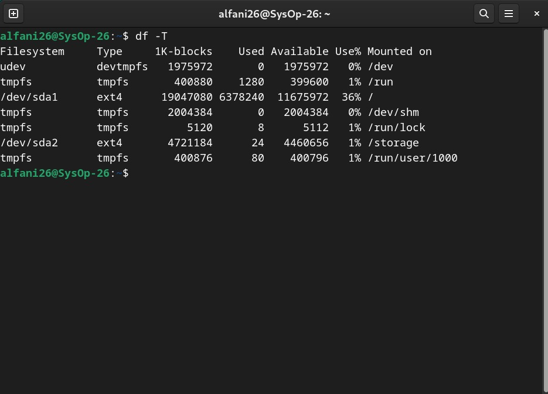
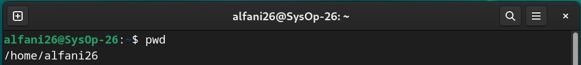
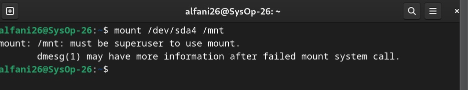
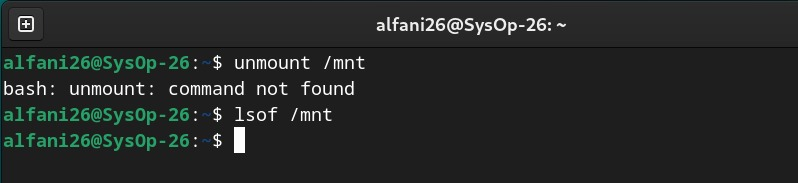
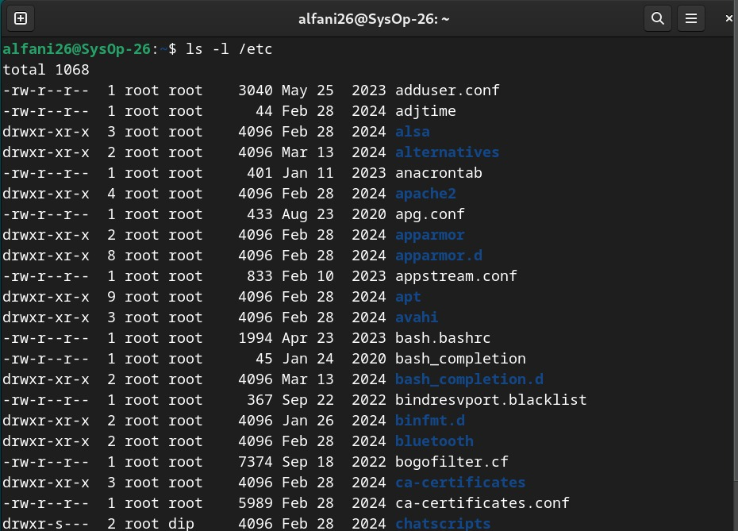
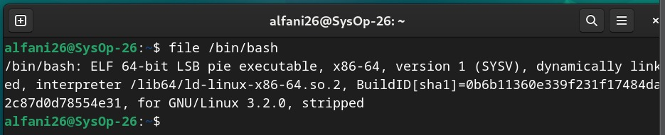

<div align="center">
    <h1 style="text-align: center;font-weight: bold">Laporan Workshop Administrasi Jaringan<br></h1>
    <h2 style="text-align: center;">Chapter 4 <br></h2>
    <h4 style="text-align: center;">Dosen Pengampu : Dr. Ferry Astika Saputra, S.T., M.Sc.</h4>
</div>
<br />
<div align="center">
    
    <h3 style="text-align: center;">Disusun Oleh :</h3>
    <p style="text-align: center;">
        <strong>Marieta Nona Alfani (3123500025)</strong>
    </p>
    <h3 style="text-align: center;line-height: 1.5">Politeknik Elektronika Negeri Surabaya<br>Departemen Teknik Informatika Dan Komputer<br>Program Studi Teknik Informatika<br>2025/2026</h3>
    <hr>
</div>
<br>

# Bab 5: Sistem File pada Unix dan Linux

## 📌 Daftar Isi
- [Konsep Dasar Sistem File](#konsep-dasar-sistem-file)
- [Pathname (Jalur File)](#pathname-jalur-file)
- [Mounting dan Unmounting Filesystem](#mounting-dan-unmounting-filesystem)
- [Struktur File Tree](#struktur-file-tree)
- [Jenis File dalam Sistem File](#jenis-file-dalam-sistem-file)
- [Hard Links vs. Symbolic Links](#hard-links-vs-symbolic-links)
- [Izin dan Kepemilikan File](#izin-dan-kepemilikan-file)
- [Access Control Lists (ACLs)](#access-control-lists-acls)
- [Kesimpulan](#kesimpulan)

---

## Konsep Dasar Sistem File
Sistem file terdiri dari beberapa komponen utama:
1. **Namespace** – Struktur penamaan file.
2. **API** – Perintah untuk mengakses dan mengelola file.
3. **Model Keamanan** – Pengaturan hak akses dan perlindungan file.
4. **Implementasi** – Cara sistem file diterapkan dalam perangkat keras.

Beberapa sistem file yang umum digunakan:
- **ext4, XFS, UFS** – Umum pada Linux/Unix.
- **ZFS, Btrfs** – Menawarkan fitur lanjutan seperti snapshot.
- **FAT, NTFS** – Digunakan pada Windows.
- **ISO 9660** – Untuk CD/DVD.

💡 **Cek Sistem File yang Digunakan:**

```bash
df -T
```

---

## Pathname (Jalur File)
Pathname adalah alamat file dalam sistem file, yang terbagi menjadi:
- **Path Absolut** → Contoh: `/home/user/file.txt`
- **Path Relatif** → Contoh: `./file.txt`

💡 **Cek Path Absolut:**

```bash
pwd
```

---

## Mounting dan Unmounting Filesystem
### Mounting Filesystem
Menambahkan partisi ke dalam sistem:

```bash
mount /dev/sda4 /mnt
```

### Unmounting Filesystem
Melepaskan partisi dari sistem:

```bash
umount /mnt
```

💡 **Cek Proses yang Menggunakan Filesystem:**
```bash
lsof /mnt
```

---

## Struktur File Tree
Struktur file tree memiliki beberapa direktori utama:
- `/etc` – File konfigurasi sistem.
- `/bin` & `/sbin` – Perintah dasar sistem.
- `/tmp` – Penyimpanan file sementara.
- `/dev` – File perangkat keras.
- `/var` – Log dan data aplikasi yang sering berubah.

💡 **Cek Isi Direktori `/etc`:**

```bash
ls -l /etc
```

---

## Jenis File dalam Sistem File
Jenis-jenis file pada Unix/Linux:
1. **Regular files** – File teks, program, dll.
2. **Directories** – Folder yang menyimpan file.
3. **Character device files** – Berinteraksi dengan perangkat dalam mode karakter.
4. **Block device files** – Digunakan oleh penyimpanan seperti hard disk.
5. **Sockets** – Untuk komunikasi antar proses.
6. **Named pipes (FIFOs)** – Komunikasi antar proses dalam antrian.
7. **Symbolic links** – Tautan ke file lain.

💡 **Cek Jenis File:**

```bash
file /bin/bash
```

---

## Hard Links vs. Symbolic Links
### Hard Links
Mengacu langsung ke inode file asli.
```bash
ln /etc/passwd /tmp/passwd
```

### Symbolic Links (Soft Links)
Tautan yang menunjuk ke file lain berdasarkan nama.
```bash
ln -s /bin/bash /tmp/bash-link
```

💡 **Cek Symbolic Link:**
```bash
ls -l /tmp/bash-link
```

---

## Izin dan Kepemilikan File
### 🔹 Mode dan Izin File
Izin file terdiri dari:
- **r (read)** – Membaca file.
- **w (write)** – Mengedit file.
- **x (execute)** – Menjalankan file.

💡 **Cek Izin File:**
```bash
ls -l file.txt
```

### Mengubah Izin File
```bash
chmod 755 script.sh
```

### Mengubah Kepemilikan File
```bash
chown user:group file.txt
chgrp group file.txt
```

---

## Access Control Lists (ACLs)
### 🔹 Melihat ACL
```bash
getfacl file.txt
```

### Menambahkan ACL
```bash
setfacl -m u:user2:rw file.txt
```

💡 **Cek ACL Setelah Perubahan:**
```bash
getfacl file.txt
```

---

## Kesimpulan
- **Sistem file** mengatur penyimpanan dan akses data secara terstruktur.
- **Pathname** bisa absolut atau relatif.
- **Mounting** menghubungkan partisi ke sistem.
- **Struktur file tree** memiliki beberapa direktori utama.
- **Jenis file** meliputi file biasa, direktori, link, dan perangkat.
- **Izin file** diatur dengan `chmod`, `chown`, dan `chgrp`.
- **ACLs** memungkinkan pengaturan izin lebih fleksibel.
