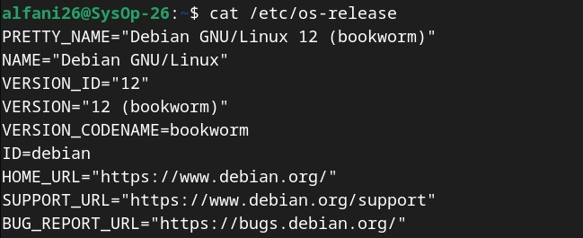
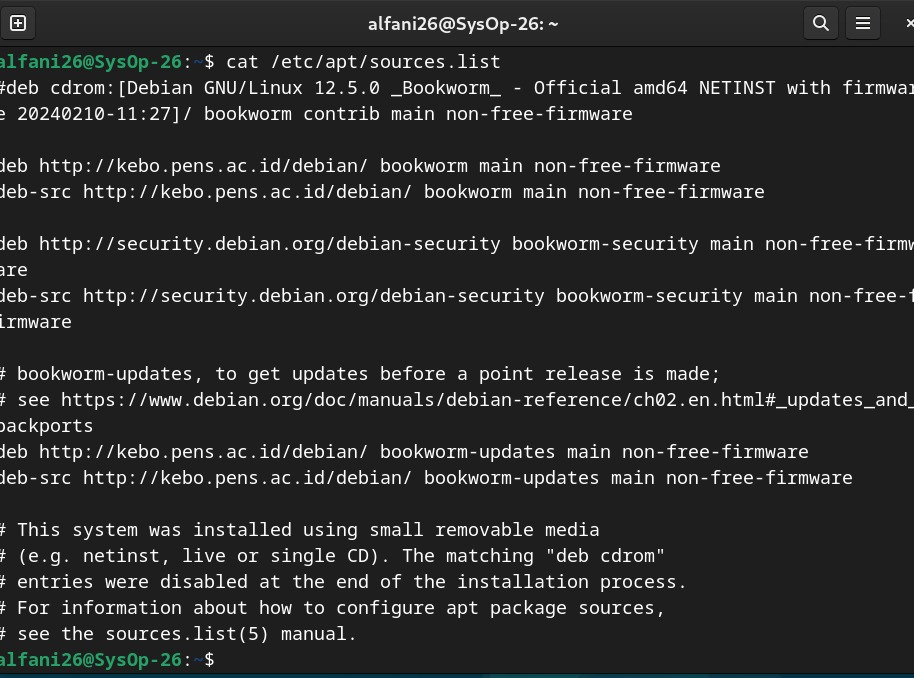
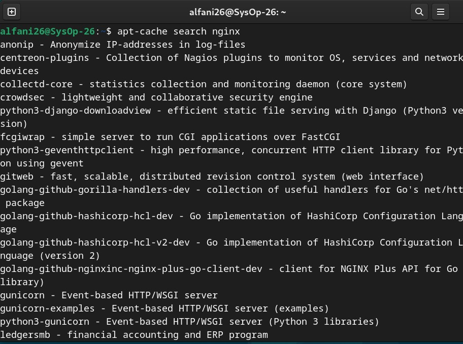
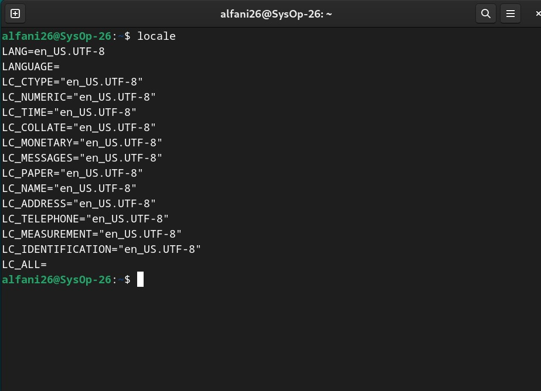

<div align="center">
    <h1 style="text-align: center;font-weight: bold">Laporan Workshop Administrasi Jaringan<br></h1>
    <h2 style="text-align: center;">Chapter 4 <br></h2>
    <h4 style="text-align: center;">Dosen Pengampu : Dr. Ferry Astika Saputra, S.T., M.Sc.</h4>
</div>
<br />
<div align="center">
    
    <h3 style="text-align: center;">Disusun Oleh :</h3>
    <p style="text-align: center;">
        <strong>Marieta Nona Alfani (3123500025)</strong>
    </p>
    <h3 style="text-align: center;line-height: 1.5">Politeknik Elektronika Negeri Surabaya<br>Departemen Teknik Informatika Dan Komputer<br>Program Studi Teknik Informatika<br>2025/2026</h3>
    <hr>
</div>
<br>

# Bab 6: Instalasi Perangkat Lunak di Unix dan Linux

## Daftar Isi
1. [Instalasi Sistem Operasi](#1-instalasi-sistem-operasi)
2. [Sistem Manajemen Paket di Linux](#2-sistem-manajemen-paket-di-linux)
3. [Manajemen Paket Tingkat Tinggi](#3-manajemen-paket-tingkat-tinggi)
4. [Lokalisasi dan Konfigurasi Perangkat Lunak](#4-lokalisasi-dan-konfigurasi-perangkat-lunak)
5. [Kesimpulan](#5-kesimpulan)

## 1. Instalasi Sistem Operasi
Linux dan FreeBSD memiliki prosedur instalasi yang cukup sederhana. Untuk perangkat fisik, sistem operasi dapat dipasang menggunakan CD, DVD, atau USB. Sedangkan untuk mesin virtual, proses boot dilakukan melalui file ISO. Instalasi menggunakan media lokal biasanya lebih mudah karena tersedia antarmuka grafis yang memandu pengguna.

### 1.1 Instalasi melalui Jaringan
Jika sistem operasi perlu dipasang pada banyak komputer, metode media lokal menjadi kurang efisien. Alternatif yang lebih baik adalah instalasi melalui jaringan menggunakan server, yang memanfaatkan layanan seperti:

- **DHCP dan TFTP** untuk melakukan booting tanpa media fisik.
- **HTTP, FTP, atau NFS** untuk mengambil file instalasi dari server.

PXE (*Preboot eXecution Environment*) memungkinkan komputer melakukan boot langsung dari jaringan tanpa perlu media penyimpanan lokal. Ini bekerja dengan menggunakan API yang tertanam dalam ROM kartu jaringan.

💡 **Percobaan**  
Cek apakah komputer mendukung PXE dengan perintah:

```bash
dmesg | grep -i pxe
```

## 2. Sistem Manajemen Paket di Linux
Linux menggunakan dua format paket utama:

1. **RPM (Red Hat Package Manager)** – Digunakan oleh Red Hat, CentOS, Fedora, dan SUSE.
2. **DEB (Debian Package)** – Digunakan oleh Debian dan Ubuntu.

Alat dasar untuk mengelola paket:

- `rpm` untuk sistem berbasis RPM.
- `dpkg` untuk sistem berbasis DEB.

Untuk mempermudah pengelolaan, terdapat alat tingkat lanjut:

- **YUM** (*Yellowdog Updater, Modified*) untuk sistem berbasis RPM.
- **APT** (*Advanced Package Tool*) untuk sistem berbasis DEB.

💡 **Percobaan**  
Cek sistem manajemen paket yang digunakan pada sistem Anda:

```bash
cat /etc/os-release
```

## 3. Manajemen Paket Tingkat Tinggi
Manajer paket tingkat tinggi memudahkan pencarian, pemasangan, dan pembaruan perangkat lunak.

### 3.1 Repositori Paket
Repositori perangkat lunak adalah server yang menyimpan paket yang bisa diunduh dan diinstal. Repositori biasanya terdiri dari:

- **Release** – Snapshot dari semua paket dalam satu rilis.
- **Komponen** – Subset perangkat lunak dalam suatu rilis.
- **Arsitektur** – Jenis prosesor yang didukung, misalnya `x86_64` untuk 64-bit.

💡 **Percobaan**  
Lihat daftar repositori yang dikonfigurasi pada sistem Debian/Ubuntu:

```bash
cat /etc/apt/sources.list
```

### 3.2 APT: Advanced Package Tool
APT adalah sistem manajemen paket yang digunakan pada Debian dan turunannya. Alat yang tersedia dalam APT meliputi:

- `apt-get` – Menginstal, menghapus, dan memperbarui paket.
- `apt-cache` – Mencari informasi paket.
- `apt-file` – Mencari file dalam paket.
- `aptitude` – Antarmuka tingkat tinggi untuk mengelola paket.

💡 **Percobaan**  
Cari paket yang tersedia menggunakan `apt-cache`:

```bash
apt-cache search nginx
```

### 3.3 YUM: Yellowdog Updater, Modified
YUM digunakan pada sistem berbasis RPM untuk menangani dependensi paket saat instalasi, pembaruan, dan penghapusan.

💡 **Percobaan**  
Lihat daftar repositori yang tersedia di sistem berbasis RPM:

```bash
yum repolist
```

## 4. Lokalisasi dan Konfigurasi Perangkat Lunak
Setelah menginstal perangkat lunak, sering kali perlu dilakukan penyesuaian agar sesuai dengan kebutuhan sistem atau pengguna. Hal ini mencakup:

- Menyesuaikan pengaturan bahasa dan waktu.
- Mengonfigurasi file sistem agar sesuai dengan lingkungan lokal.
- Mengoptimalkan performa perangkat lunak untuk penggunaan spesifik.

💡 **Percobaan**  
Cek pengaturan lokal yang digunakan sistem Anda:

```bash
locale
```

## 5. Kesimpulan
- **Instalasi sistem operasi** dapat dilakukan melalui media lokal atau jaringan.
- **Manajemen paket** menggunakan RPM (`rpm`, `yum`) atau DEB (`dpkg`, `apt`).
- **Repositori paket** menyimpan perangkat lunak yang dapat diunduh dan diperbarui.
- **APT dan YUM** adalah alat yang mempermudah pengelolaan paket.
- **Lokalisasi dan konfigurasi** penting untuk menyesuaikan perangkat lunak dengan kebutuhan pengguna.
