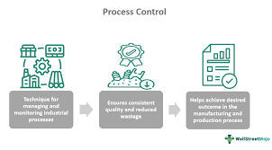

<div align="center">
    <h1 style="text-align: center;font-weight: bold">Laporan Workshop Administrasi Jaringan<br></h1>
    <h2 style="text-align: center;">Chapter 4 <br></h2>
    <h4 style="text-align: center;">Dosen Pengampu : Dr. Ferry Astika Saputra, S.T., M.Sc.</h4>
</div>
<br />
<div align="center">
  
    <h3 style="text-align: center;">Disusun Oleh :</h3>
    <p style="text-align: center;">
        <strong>Marieta Nona Alfani (3123500025)</strong>
    </p>
    <h3 style="text-align: center;line-height: 1.5">Politeknik Elektronika Negeri Surabaya<br>Departemen Teknik Informatika Dan Komputer<br>Program Studi Teknik Informatika<br>2025/2026</h3>
    <hr>
</div>
<br>

# Chapter 4: Process Control



## Komponen dari Sebuah Proses

Sebuah proses terdiri dari ruang alamat dan sekumpulan struktur data dalam kernel. Ruang alamat adalah sekumpulan halaman memori yang dialokasikan oleh kernel untuk digunakan oleh proses. Halaman-halaman ini digunakan untuk menyimpan kode, data, dan tumpukan (*stack*) proses.

Struktur data dalam kernel melacak berbagai informasi tentang setiap proses:

- Peta ruang alamat proses
- Status proses saat ini (berjalan, tidur, dll.)
- Prioritas proses
- Sumber daya yang digunakan (CPU, memori, dll.)
- File dan port jaringan yang terbuka
- Masker sinyal proses (sinyal yang saat ini diblokir)
- Pemilik proses (UID dari pengguna yang menjalankan proses)

### **PID dan PPID**
- **PID (Process ID):** Setiap proses memiliki ID unik yang diberikan oleh kernel saat proses dibuat.
- **PPID (Parent Process ID):** Setiap proses memiliki proses induk yang menciptakannya.

### **UID dan EUID**
- **UID (User ID):** ID pengguna yang menjalankan proses.
- **EUID (Effective User ID):** ID yang digunakan oleh proses untuk menentukan hak akses ke sumber daya.

## **Siklus Hidup Proses**

Proses baru dibuat dengan pemanggilan sistem **fork()**, yang menciptakan salinan dari proses induk. Linux menggunakan **clone()**, yang merupakan perluasan dari **fork()**.

Ketika sistem booting, kernel membuat beberapa proses penting, salah satunya adalah **init/systemd**, yang memiliki **PID 1** dan bertanggung jawab mengelola proses sistem.

## **Sinyal dalam Proses**

Sinyal digunakan untuk memberi notifikasi kepada proses terkait suatu kejadian:

- **KILL**: Menghentikan proses secara paksa (tidak bisa diblokir).
- **INT**: Menginterupsi proses ketika pengguna menekan `Ctrl+C`.
- **TERM**: Meminta proses untuk berhenti dengan cara yang aman.
- **HUP**: Menginformasikan proses bahwa terminal telah ditutup.
- **QUIT**: Menghentikan proses dan menghasilkan *core dump*.


## **Mengelola Proses**

### **Perintah untuk Mengontrol Proses**
- **kill**: Mengirim sinyal ke proses tertentu berdasarkan PID.
- **ps**: Menampilkan daftar proses yang sedang berjalan.
- **top/htop**: Memantau proses secara real-time.
- **nice & renice**: Mengatur prioritas eksekusi proses.
- **strace/truss**: Melacak aktivitas sistem dari suatu proses.

```bash
# Menghentikan proses dengan PID tertentu
kill -9 PID

# Menampilkan semua proses yang berjalan
top

# Menjalankan proses dengan prioritas lebih rendah
nice -n 10 command
```

## **Proses Tidak Terkontrol (Runaway Process)**

Proses yang menggunakan 100% CPU dan memperlambat sistem disebut *runaway process*.

```bash
# Menghentikan proses yang tidak merespons
kill -9 PID

# Melihat file yang sedang digunakan oleh suatu proses
lsof -p PID
```

## **Proses Terjadwal**

### **cron: Menjadwalkan Eksekusi Tugas**

*cron* digunakan untuk menjalankan perintah sesuai jadwal.

```bash
# Format crontab
*     *     *     *     *  perintah
-     -     -     -     -
|     |     |     |     |
|     |     |     |     +----- hari dalam seminggu (0 - 6, Minggu = 0)
|     |     |     +------- bulan (1 - 12)
|     |     +--------- hari dalam bulan (1 - 31)
|     +----------- jam (0 - 23)
+------------- menit (0 - 59)
```

Contoh:

```bash
# Menjalankan skrip setiap hari pada pukul 02:30
30 2 * * * /usr/bin/python3 /path/to/script.py
```

### **Systemd Timer**
Sebagai alternatif dari *cron*, *systemd timer* menyediakan fitur penjadwalan yang lebih fleksibel.

```bash
$ systemctl list-timers
```


## **Kesimpulan**
Manajemen proses dalam sistem operasi sangat penting untuk efisiensi dan stabilitas sistem. Dengan memahami cara kerja **PID, sinyal, dan alat monitoring**, administrator dapat mengontrol proses dengan lebih baik. Selain itu, mekanisme otomatisasi seperti **cron dan systemd timer** membantu dalam menjalankan tugas-tugas berulang tanpa campur tangan pengguna.
