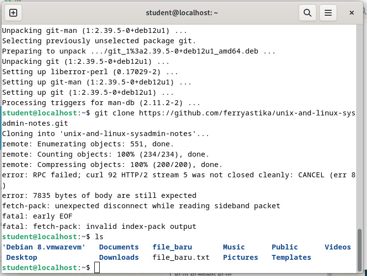

    <h1 style="text-align: center;font-weight: bold">Laporan Workshop Administrasi Jaringan </h1>
    <h2 style="text-align: center;">Instalasi Debian  </h2>
    <h4 style="text-align: center;">Dosen Pengampu : Dr. Ferry Astika Saputra, S.T., M.Sc.</h4>

 

    
    <h3 style="text-align: center;">Disusun Oleh :</h3>
    

        <strong>Marieta Nona Alfani (3123500025)</strong>
    

    <h3 style="text-align: center;line-height: 1.5">Politeknik Elektronika Negeri Surabaya Departemen Teknik Informatika Dan Komputer Program Studi Teknik Informatika 2025/2026</h3>
    

 

# **Instalasi Debian**

## **1. Mendapatkan Alamat IP dari DHCP Server**  
Sistem akan meminta alamat IP dari server DHCP untuk konektivitas jaringan.  
 

## **2. Menginstal Git dan Dependensi yang Diperlukan**  
Paket Git serta dependensi yang dibutuhkan dipasang di sistem.  
 

## **3. Melakukan Clone Repository Git**  
Proses kloning repository dilakukan untuk mendapatkan file atau konfigurasi yang dibutuhkan.  
 

## **4. Mengunduh dan Menginstal VirtualBox untuk Linux**  
Versi VirtualBox yang sesuai dengan sistem operasi Linux diunduh, dengan memilih opsi Debian 12.  
 

**Buka menggunakan terminal:**  
 

## **5. Mengunduh File ISO Debian**  
Berkas ISO Debian diunduh sebagai media instalasi sistem operasi.  
 

## **6. Menginstal Paket VirtualBox dengan Perintah Dpkg**  
Paket VirtualBox diinstal menggunakan `dpkg` untuk memastikan kompatibilitasnya dengan sistem.  
 

## **7. Mengatasi Error saat Menjalankan VirtualBox**  
Jika terdapat error saat menjalankan VirtualBox, dilakukan perbaikan dengan menyesuaikan dependensi yang kurang.  
 

## **8. Memeriksa dan Menginstal Driver Kernel yang Dibutuhkan**  
   Kesalahan bisa terjadi karena driver kernel belum terpasang atau belum dimuat dengan benar, sehingga perlu dilakukan instalasi dan pemuatan ulang driver.  
     
   

## **9. Membuat Mesin Virtual di VirtualBox**  
   Mesin virtual baru dibuat dengan konfigurasi perangkat keras dan hard disk yang sesuai.  
     
    
     
   
   

## **10. Memulai Instalasi Debian**
Setelah semua persiapan selesai, instalasi Debian dijalankan pada mesin virtual yang telah dibuat.  
    
   
